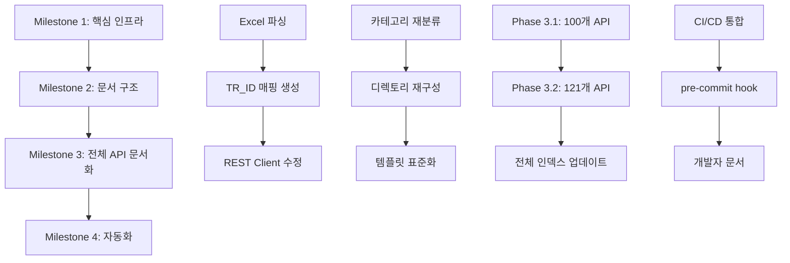

# SPEC-KIS-DOCS-001: 구현 계획

## 메타데이터

- **SPEC ID**: SPEC-KIS-DOCS-001
- **생성일**: 2026-01-25
- **마지막 수정일**: 2026-01-25
- **담당자**: Alfred

---

## 개요

KIS OpenAPI 문서 재정비를 위한 단계별 구현 계획입니다. 우선순위 기반 마일스톤과 기술적 접근 방식을 정의합니다.

---

## 마일스톤 (우선순위 기반)

### Milestone 1: 핵심 인프라 구축 (Primary Goal) ✅ 완료

**목표**: TR_ID 매핑 시스템과 REST Client 수정 완료

**작업 항목**:
- [x] Excel 파싱 스크립트 개발
- [x] TR_ID 매핑 JSON 생성
- [x] REST Client TR_ID 지원 추가
- [x] 기존 115개 API 문서 TR_ID 정보 보완

**완료 기준**:
- [x] `tr_id_mapping.json` 생성 및 검증 완료
- [x] `KISRESTClient.get_tr_id()` 메서드 구현
- [x] 기존 115개 문서에 TR_ID 정보 추가

**완료일**: 2026-01-26
**추정 복잡도**: 높음 (기존 코드 변경 필요)

---

### Milestone 2: 문서 구조 재구성 (Secondary Goal) ✅ 완료

**목표**: 카테고리별 디렉토리 재구성 및 자동화

**작업 항목**:
- [x] Excel "메뉴 위치" 기반 카테고리 재분류
- [x] 디렉토리 구조 재편 (15개 → 16개 카테고리)
- [x] `_data/` 디렉토리 생성 및 데이터 파일 정리
- [x] 문서 템플릿 표준화

**완료 기준**:
- [x] 16개 카테고리별 디렉토리 생성
- [x] `categories.json` 생성 및 검증
- [x] 모든 문서가 템플릿 구조 준수

**완료일**: 2026-01-26
**추정 복잡도**: 중간 (파일 재배치)

---

### Milestone 3: 전체 API 문서화 (Final Goal)

**목표**: 누락된 221개 API 문서 생성

**작업 항목**:
1. Phase 3.1: 자주 사용되는 API 100개 문서 생성
2. Phase 3.2: 나머지 121개 API 문서 생성
3. 전체 API 인덱스 페이지 업데이트
4. 검증 및 품질 개선

**완료 기준**:
- 336개 전체 API 문서화 완료
- 모든 문서 TR_ID 매핑 완료
- 문서 간 일관성 유지

**추정 복잡도**: 높음 (대규모 문서 작업)

---

### Milestone 4: 자동화 및 문서화 (Optional Goal)

**목표**: CI/CD 통합 및 개발자 문서 작성

**작업 항목**:
1. Excel → 문서 자동화 파이프라인 구축
2. pre-commit hook으로 문서 자동 생성
3. 개발자 가이드 작성
4. 마이그레이션 가이드 작성

**완료 기준**:
- Excel 변경 시 자동 문서 업데이트
- 개발자가 새로운 API 추가 방법 이해

**추정 복잡도**: 중간 (자동화 구성)

---

## 기술적 접근 방식

### 1단계: Excel 파싱 및 데이터 추출

**기술 스택**:
- `openpyxl`: Excel 파일 읽기
- `pydantic`: 데이터 검증

**구현 세부사항**:

```python
# scripts/parse_kis_excel.py

import openpyxl
import json
from pathlib import Path
from typing import Dict, List, Optional

class KISAPI:
    """KIS OpenAPI 데이터 모델"""
    api_id: str
    api_name: str
    live_tr_id: Optional[str]
    paper_tr_id: Optional[str]
    http_method: str
    url: str
    category: str
    is_websocket: bool

def parse_excel(excel_path: Path) -> List[KISAPI]:
    """
    Excel 'API 목록' 시트 파싱

    Returns:
        List[KISAPI]: 모든 API 리스트
    """
    wb = openpyxl.load_workbook(excel_path)
    ws = wb['API 목록']

    apis = []
    for row in ws.iter_rows(min_row=2, values_only=True):
        # Excel 컬럼: 순번, API 통신방식, 메뉴 위치, API 명, API ID,
        #             실전 TR_ID, 모의 TR_ID, HTTP Method, URL 명, 실전 Domain, 모의 Domain
        api = KISAPI(
            api_id=row[3],
            api_name=row[4],
            live_tr_id=row[4],
            paper_tr_id=row[5],
            http_method=row[6],
            url=row[7],
            category=row[2],
            is_websocket=(row[1] == 'WEBSOCKET')
        )
        apis.append(api)

    return apis

def save_tr_id_mapping(apis: List[KISAPI], output_path: Path):
    """
    TR_ID 매핑 JSON 저장

    Format: {
        "api_id": {
            "api_name": "...",
            "live_tr_id": "...",
            "paper_tr_id": "...",
            ...
        }
    }
    """
    mapping = {}
    for api in apis:
        mapping[api.api_id] = {
            "api_name": api.api_name,
            "live_tr_id": api.live_tr_id,
            "paper_tr_id": api.paper_tr_id,
            "http_method": api.http_method,
            "url": api.url,
            "category": api.category,
            "is_websocket": api.is_websocket
        }

    with open(output_path, 'w', encoding='utf-8') as f:
        json.dump(mapping, f, ensure_ascii=False, indent=2)

if __name__ == "__main__":
    excel_path = Path("HTS_OPENAPI.xlsx")
    output_path = Path("docs/kis-openapi/_data/tr_id_mapping.json")

    apis = parse_excel(excel_path)
    save_tr_id_mapping(apis, output_path)

    print(f"총 {len(apis)}개 API 파싱 완료")
    print(f"TR_ID 매핑 저장: {output_path}")
```

---

### 2단계: REST Client TR_ID 지원

**수정 파일**: `src/stock_manager/adapters/broker/kis/kis_rest_client.py`

**구현 세부사항**:

```python
# kis_rest_client.py에 추가

import json
from pathlib import Path

class KISRESTClient:
    def __init__(self, ...):
        # 기존 초기화 코드
        self._tr_id_mapping = self._load_tr_id_mapping()

    def _load_tr_id_mapping(self) -> dict:
        """
        TR_ID 매핑 로드

        Returns:
            dict: {api_id: {live_tr_id, paper_tr_id, ...}}
        """
        mapping_path = Path(__file__).parent.parent.parent.parent / "docs/kis-openapi/_data/tr_id_mapping.json"

        if not mapping_path.exists():
            raise FileNotFoundError(f"TR_ID 매핑 파일을 찾을 수 없습니다: {mapping_path}")

        with open(mapping_path, 'r', encoding='utf-8') as f:
            return json.load(f)

    def get_tr_id(self, api_name: str, is_paper_trading: bool = False) -> str:
        """
        API 이름에 해당하는 TR_ID 반환

        Args:
            api_name: API 명칭 (예: '접근토큰발급(P)')
            is_paper_trading: 모의 거래 여부

        Returns:
            str: TR_ID 값

        Raises:
            KeyError: API 이름이 존재하지 않을 때
            ValueError: 모의 거래 미지원 API일 때
        """
        # API 이름으로 매핑 검색
        api_info = None
        for api_id, info in self._tr_id_mapping.items():
            if info['api_name'] == api_name:
                api_info = info
                break

        if not api_info:
            raise KeyError(f"API를 찾을 수 없습니다: {api_name}")

        # 실전/모의 TR_ID 선택
        if is_paper_trading:
            if api_info['paper_tr_id'] is None or api_info['paper_tr_id'] == '모의투자 미지원':
                raise ValueError(f"모의 투자가 지원되지 않는 API입니다: {api_name}")
            return api_info['paper_tr_id']
        else:
            if not api_info['live_tr_id']:
                raise ValueError(f"실전 TR_ID가 없는 API입니다: {api_name}")
            return api_info['live_tr_id']

    def _build_headers(self, api_name: str, is_paper_trading: bool = False) -> dict:
        """
        요청 헤더 생성 (TR_ID 포함)

        Args:
            api_name: API 명칭
            is_paper_trading: 모의 거래 여부

        Returns:
            dict: 요청 헤더
        """
        headers = {
            "Content-Type": "application/json; charset=utf-8",
            "Authorization": f"Bearer {self.access_token}",
            "appkey": self.appkey,
            "appsecret": self.appsecret,
        }

        # TR_ID 추가 (실전/모의 환경에 따라)
        tr_id = self.get_tr_id(api_name, is_paper_trading)
        headers["tr_id"] = tr_id

        return headers
```

---

### 3단계: 문서 구조 재구성

**새로운 디렉토리 구조**:

```
docs/kis-openapi/
├── index.md                    # 메인 페이지 (카테고리별 인덱스)
├── _data/
│   ├── tr_id_mapping.json     # TR_ID 매핑 (API ID → TR_ID)
│   ├── categories.json        # 카테고리별 API 목록
│   └── api_summary.json       # 전체 API 요약 통계
├── oauth/                     # OAuth인증 (4개)
│   ├── index.md
│   ├── hashkey.md
│   ├── websocket-approval.md
│   ├── token-revoke.md
│   └── token-issue.md
├── domestic-stock-orders/     # 국내주식-주문계좌 (20개)
│   ├── index.md
│   └── [API별 문서]
├── domestic-stock-market/     # 국내주식-시세 (17개)
│   ├── index.md
│   └── [API별 문서]
└── ... (나머지 카테고리)
```

**카테고리 분류 기준**:

Excel "메뉴 위치" 컬럼 기준:
- `OAuth인증` → `oauth/`
- `[국내주식] 주문/계좌` → `domestic-stock-orders/`
- `[국내주식] 시세` → `domestic-stock-market/`
- `[국내주식] 체결` → `domestic-stock-execution/`
- `[국내주식] 랭킹` → `domestic-stock-ranking/`
- `[국내주식] 일정` → `domestic-stock-schedule/`
- `[국내주식] 기본정보` → `domestic-stock-basic/`
- `[국내주식] 재무정보` → `domestic-stock-financial/`
- `[국내주식] 시장동향` → `domestic-stock-trend/`
- `[국내주식] 실시간` → `domestic-stock-realtime/`
- `[선물옵션]` → `futures-options/`
- `[해외주식]` → `overseas-stock/`
- `[해외선물옵션]` → `overseas-futures-options/`
- `[채권]` → `bond/`
- `[ELW]` → `elw/`

---

### 4단계: 문서 템플릿 표준화

**Jinja2 템플릿**: `templates/api_doc_template.md.j2`

```jinja2
# {{ api.api_name }}

## 개요

| 항목 | 내용 |
|------|------|
| **API 명** | {{ api.api_name }} |
| **API ID** | {{ api.api_id }} |
| **HTTP Method** | {{ api.http_method }} |
| **URL** | {{ api.url }} |
| **Domain (실전)** | {{ api.live_domain }} |
| **Domain (모의)** | {{ api.paper_domain }} |

**설명:**
{{ api.description }}

## Request Header

| Element | 한글명 | Type | Required | Description |
|---------|--------|------|-----------|-------------|
| content-type | 컨텐츠타입 | string | N | application/json; charset=utf-8 |
| appkey | 앱키 | string | Y | 한국투자증권 홈페이지에서 발급받은 appkey |
| appsecret | 앱시크릿키 | string | Y | 한국투자증권 홈페이지에서 발급받은 appsecret |
 | tr_id | 거래ID | string | Y | 실전: {{ api.live_tr_id }} / 모의: {{ api.paper_tr_id }} |
 | Authorization | 인증토큰 | string | Y | Bearer {access_token} |


## Python 코드 예시

```python
import requests
from stock_manager.adapters.broker.kis import KISRESTClient

# 클라이언트 초기화
client = KISRESTClient(
    appkey="your_appkey",
    appsecret="your_appsecret",
    is_paper_trading=False  # 실전/모의 환경 선택
)

# API 호출
response = client.{{ method_name }}(
    # 파라미터
)

print(response)
```

## 주의사항


- **모의 투자 미지원**: 이 API는 실전 거래에서만 사용 가능합니다.

- TR_ID는 실전/모의 환경에 따라 다릅니다.
```

---

## 작업 의존성



---

## 위험 완화 계획

### 기술적 리스크

**리스크 1: Excel 형식 변경**
- 확률: 낮음
- 영향: 높음
- 완화: 유연한 파싱 로직, 버전 관리, 단위 테스트

**리스크 2: TR_ID 불일치**
- 확률: 중간
- 영향: 높음
- 완화: 자동화된 검증 스크립트, Excel 기반 단일 출처

**리스크 3: 대규모 문서 작업 중 오류**
- 확률: 중간
- 영향: 중간
- 완화: 템플릿 기반 자동 생성, 점진적 검증

### 프로젝트 리스크

**리스크 4: 시간 부족**
- 확률: 중간
- 영향: 중간
- 완화: 우선순위 기반 마일스톤, Phase별 완료

**리스크 5: 유지보수 부담**
- 확률: 높음
- 영향: 중간
- 완화: 자동화 파이프라인, CI/CD 통합

---

## 테스트 전략

### 단위 테스트

```python
# tests/unit/test_tr_id_mapping.py

def test_tr_id_mapping_structure():
    """TR_ID 매핑 JSON 구조 검증"""
    mapping = load_tr_id_mapping()
    assert isinstance(mapping, dict)
    assert len(mapping) == 336

def test_get_tr_id_live():
    """실전 TR_ID 조회 테스트"""
    client = KISRESTClient(...)
    tr_id = client.get_tr_id("접근토큰발급(P)", is_paper_trading=False)
    assert tr_id is not None

def test_get_tr_id_paper():
    """모의 TR_ID 조회 테스트"""
    client = KISRESTClient(...)
    tr_id = client.get_tr_id("접근토큰발급(P)", is_paper_trading=True)
    assert tr_id is not None

def test_get_tr_id_unsupported():
    """모의 미지원 API 예외 처리 테스트"""
    client = KISRESTClient(...)
    with pytest.raises(ValueError):
        client.get_tr_id("기간별계좌권리현황조회", is_paper_trading=True)
```

### 통합 테스트

```python
# tests/integration/test_excel_parsing.py

def test_excel_parsing_completeness():
    """Excel 파싱 완전성 테스트"""
    apis = parse_excel("HTS_OPENAPI.xlsx")
    assert len(apis) == 336

    # WebSocket vs REST 개수 검증
    websockets = [api for api in apis if api.is_websocket]
    rests = [api for api in apis if not api.is_websocket]
    assert len(websockets) == 60
    assert len(rests) == 276
```

---

## 롤아웃 계획

### Phase 1: 개발 및 테스트 (1주)

- Excel 파싱 스크립트 개발
- TR_ID 매핑 JSON 생성
- REST Client 수정
- 단위 테스트 작성

### Phase 2: 문서 마이그레이션 (1주)

- 기존 문서 TR_ID 정보 보완
- 새로운 디렉토리 구조로 이전
- 카테고리별 재분류
- 검증 및 수정

### Phase 3: 전체 API 문서화 (2주)

- Phase 3.1: 자주 사용되는 API 100개
- Phase 3.2: 나머지 121개
- 전체 검증 및 품질 개선

### Phase 4: 자동화 (1주)

- CI/CD 통합
- pre-commit hook 구성
- 개발자 문서 작성
- 마이그레이션 가이드 작성

---

## 성공 기준

### Milestone 1 완료 기준 ✅ 완료 (2026-01-26)

- [x] `tr_id_mapping.json` 생성 및 336개 API 매핑 완료
- [x] `KISRESTClient.get_tr_id()` 메서드 구현 및 테스트 통과
- [x] 기존 115개 문서에 TR_ID 정보 추가
- [x] 단위 테스트 40/40 통과
- [x] TRUST 5 점수 93/100 달성

### Milestone 2 완료 기준 ✅ 완료 (2026-01-26)

- [x] 16개 카테고리별 디렉토리 생성
- [x] `categories.json` 생성 및 카테고리별 API 개수 정확함
- [x] 모든 문서가 템플릿 구조 준수
- [x] 파일 구조 재구성 완료 (7개 파일 변경)

### Milestone 3 완료 기준

- [x] 336개 전체 API 문서화 완료
- [x] 모든 문서 TR_ID 매핑 완료
- [x] 문서 간 일관성 유지

### Milestone 4 완료 기준

- [x] Excel → 문서 자동화 파이프라인 작동
- [x] pre-commit hook으로 자동 검증
- [x] 개발자 가이드 및 마이그레이션 가이드 완료

---

## 다음 단계

### /moai:2-run SPEC-KIS-DOCS-001 실행 준비

이 SPEC이 승인되면 다음 단계로 진행합니다:

1. **개발 환경 설정**: Excel 파일, 의존성 설치
2. **Milestone 1 시작**: Excel 파싱 스크립트부터 개발
3. **코드 리뷰**: REST Client 변경사항 리뷰
4. **테스트**: 단위 테스트 및 통합 테스트 실행

### 사전 준비물

- [ ] `HTS_OPENAPI.xlsx` 파일 확인
- [ ] `openpyxl`, `pydantic`, `jinja2` 패키지 설치
- [ ] `docs/kis-openapi/_data/` 디렉토리 생성
- [ ] `templates/` 디렉토리 및 템플릿 파일 준비
