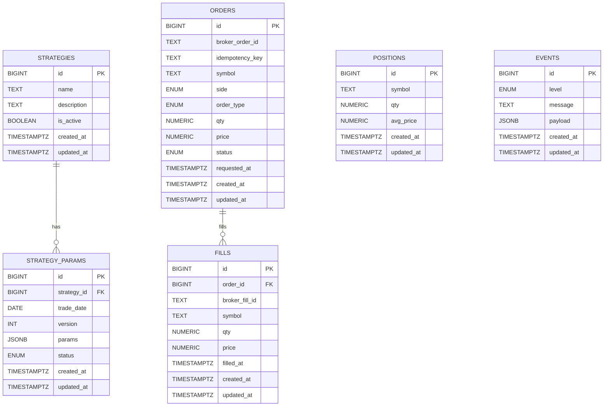
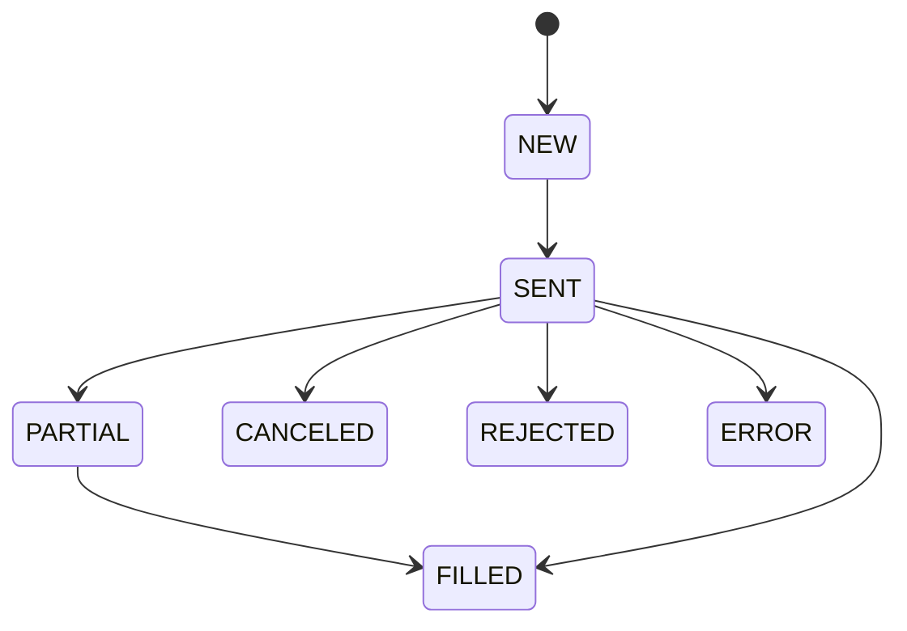
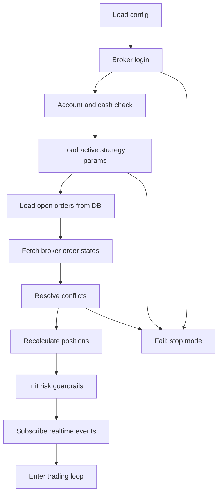
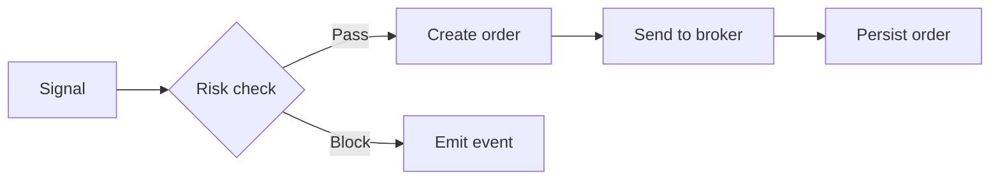

# Schema and State Diagrams (Mermaid)

This document provides visual references for the database schema and core state transitions.
For full DDL, see `ai_developer_guides/DB_SCHEMA_DDL.md`.
Use Mermaid-compatible renderers to view diagrams.

---

## 1) Core Schema (ERD)

---

## 2) Order Status State Machine

Rules:
- Transitions are one-way; no rollback.
- Broker events can skip intermediate states (e.g., SENT -> FILLED).

---

## 3) Startup Recovery Flow (Summary)

---

## 4) Risk Gate (Order Pipeline)

Notes:
- Risk check happens before broker call.
- If blocked, a structured event is recorded.
