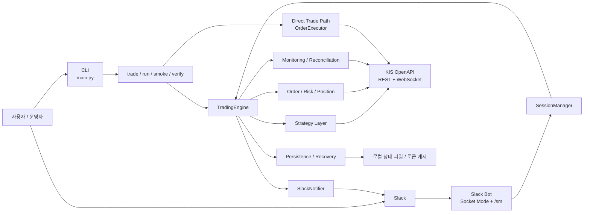
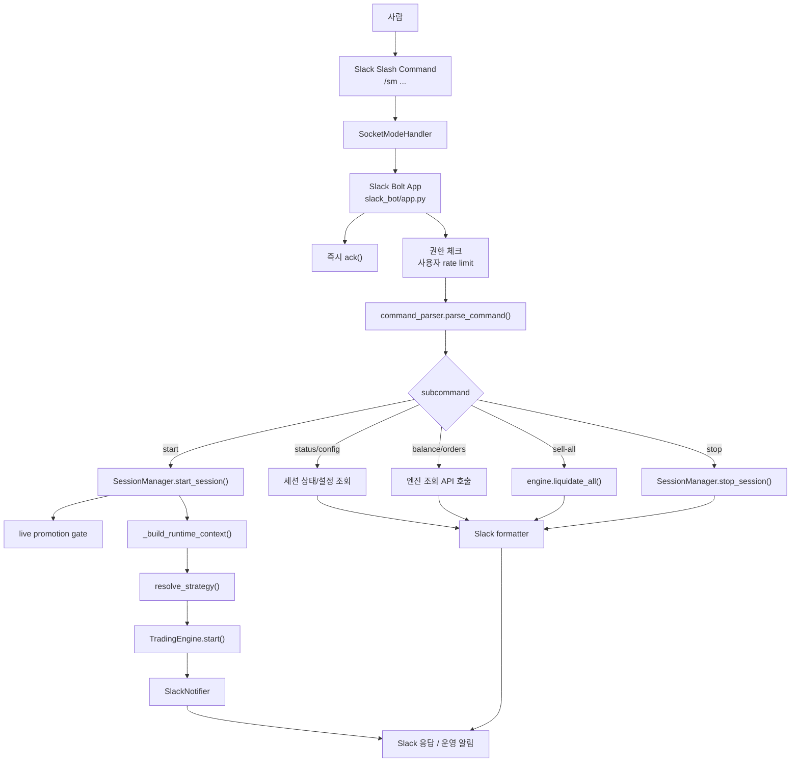
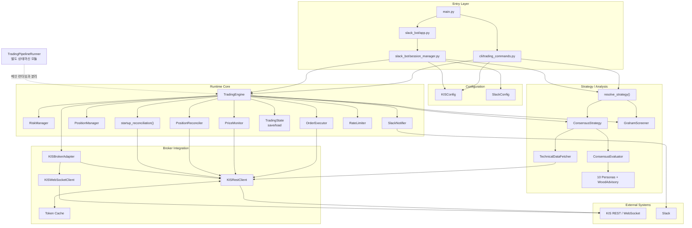
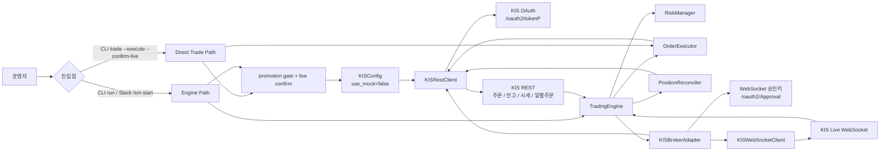
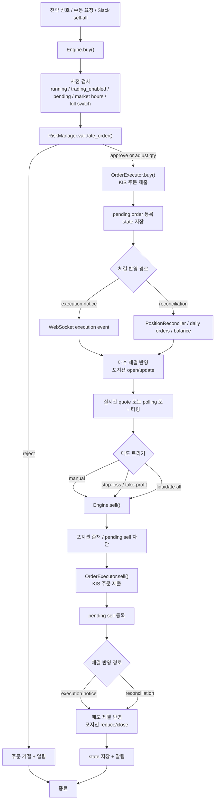
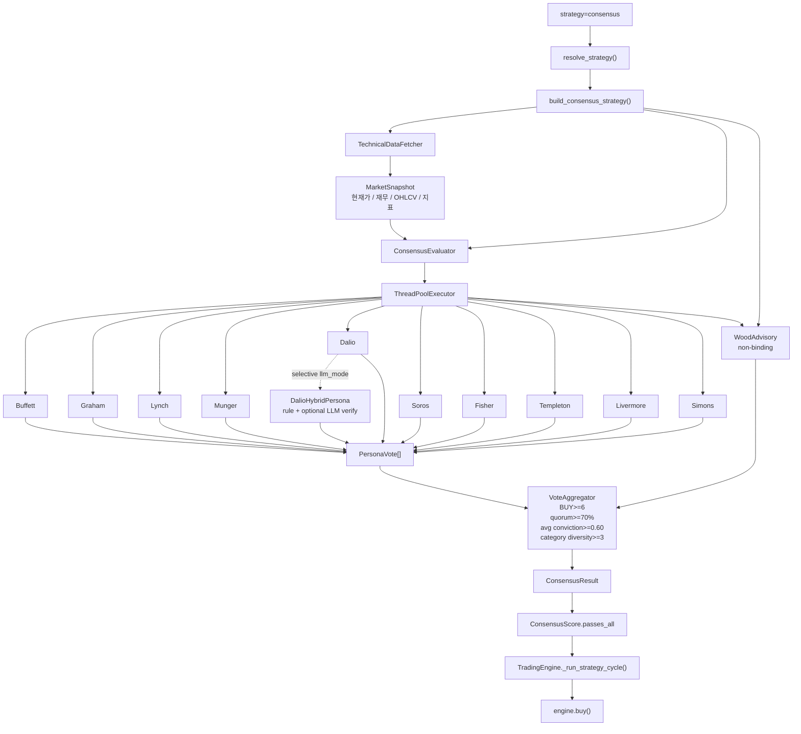

# Stock Manager 아키텍처

> 관련 문서: [README.md](../README.md) | [knowledge-map.md](knowledge-map.md) | [execution-diagrams.md](execution-diagrams.md) | [runtime-trading-guardrails.md](runtime-trading-guardrails.md)

이 문서는 현재 코드 기준의 상위 아키텍처를 한 번에 파악하기 위한 별도 설명서입니다.

전제:
- 메인 런타임 경로는 `TradingEngine` 중심입니다.
- `stock-manager trade`는 엔진을 거치지 않고 `OrderExecutor -> KISRestClient`로 직접 주문할 수 있습니다.
- `TradingPipelineRunner`는 별도 상태머신 모듈로 존재하지만, 현재 메인 CLI/Slack 런타임의 기본 진입 경로는 아닙니다.

## 목차
1. [전체 아키텍처](#1-전체-아키텍처)
2. [사람이 Slack을 통해 요청하는 아키텍처](#2-사람이-slack을-통해-요청하는-아키텍처)
3. [stock-manager 내부 아키텍처](#3-stock-manager-내부-아키텍처)
4. [실제 주식을 거래하는 아키텍처](#4-실제-주식을-거래하는-아키텍처)
5. [매수 매도 흐름](#5-매수-매도-흐름)
6. [AI persona 흐름](#6-ai-persona-흐름)
7. [코드 진입점 메모](#7-코드-진입점-메모)

---

## 1. 전체 아키텍처

---

## 2. 사람이 Slack을 통해 요청하는 아키텍처

---

## 3. stock-manager 내부 아키텍처

---

## 4. 실제 주식을 거래하는 아키텍처

이 섹션은 `KIS_USE_MOCK=false` 기준의 live trading 경로를 보여줍니다.

---

## 5. 매수 매도 흐름

---

## 6. AI persona 흐름

현재 코드 기준으로 consensus 전략은 10명의 binding persona와 1명의 advisory persona를 사용합니다.
`--llm-mode selective`는 Slack 세션에서 Dalio persona만 hybrid LLM overlay로 교체합니다.

---

## 7. 코드 진입점 메모

- 전체 CLI 진입점: `stock_manager/main.py`
- 런타임 명령 경로: `stock_manager/cli/trading_commands.py`
- Slack 명령 라우터: `stock_manager/slack_bot/app.py`
- Slack 세션 수명주기: `stock_manager/slack_bot/session_manager.py`
- 메인 런타임 오케스트레이터: `stock_manager/engine.py`
- KIS REST 클라이언트: `stock_manager/adapters/broker/kis/client.py`
- KIS REST/WS 퍼사드: `stock_manager/adapters/broker/kis/broker_adapter.py`
- 전략 팩토리: `stock_manager/trading/strategies/__init__.py`
- consensus 평가기: `stock_manager/trading/consensus/evaluator.py`
- vote 집계: `stock_manager/trading/consensus/aggregator.py`

