# Stock Manager 실행 다이어그램

## 목차
1. [시스템 아키텍처 개요](#1-시스템-아키텍처-개요)
2. [초기화 흐름](#2-초기화-흐름)
3. [OAuth 인증 흐름](#3-oauth-인증-흐름)
4. [주문 실행 흐름](#4-주문-실행-흐름)
5. [가격 모니터링 흐름](#5-가격-모니터링-흐름)
6. [포지션 조정 흐름](#6-포지션-조정-흐름)
7. [상태 저장 및 복구 흐름](#7-상태-저장-및-복구-흐름)
8. [컴포넌트 관계도](#8-컴포넌트-관계도)
9. [클래스 다이어그램](#9-클래스-다이어그램)

---

## 1. 시스템 아키텍처 개요

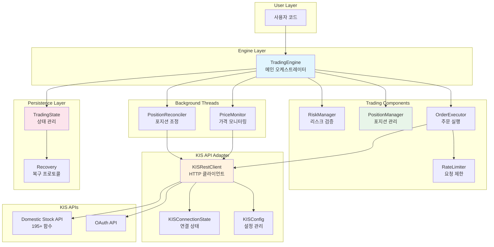

---

## 2. 초기화 흐름

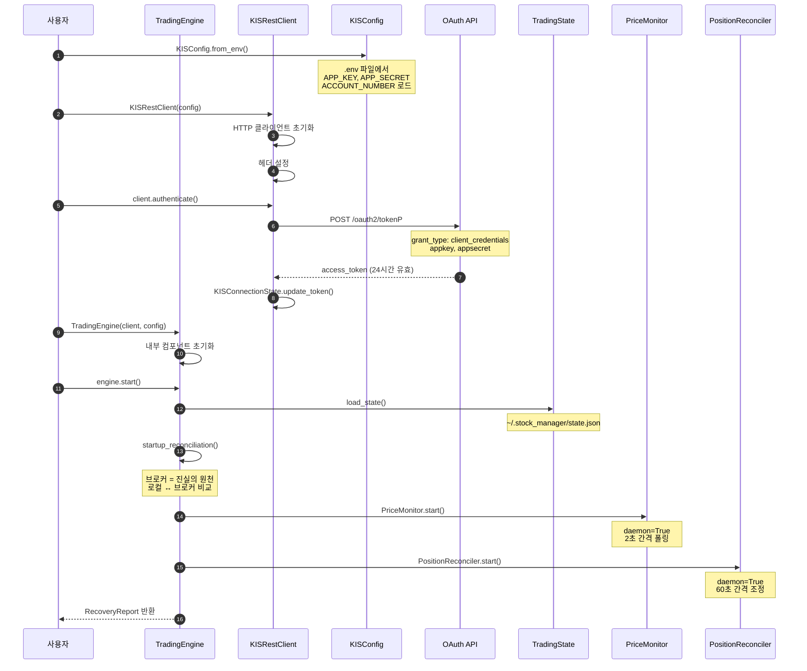

---

## 3. OAuth 인증 흐름

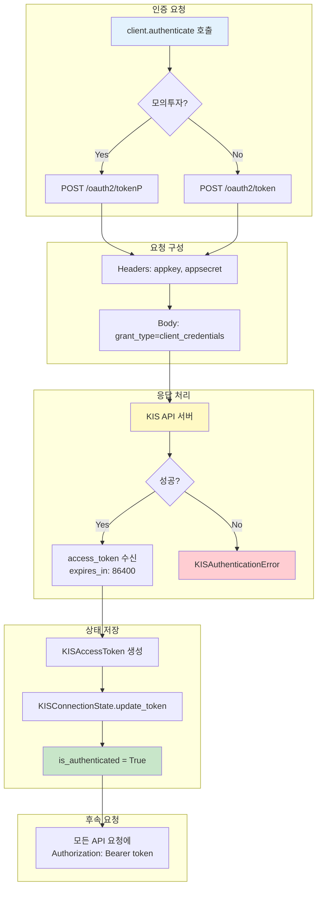

---

## 4. 주문 실행 흐름

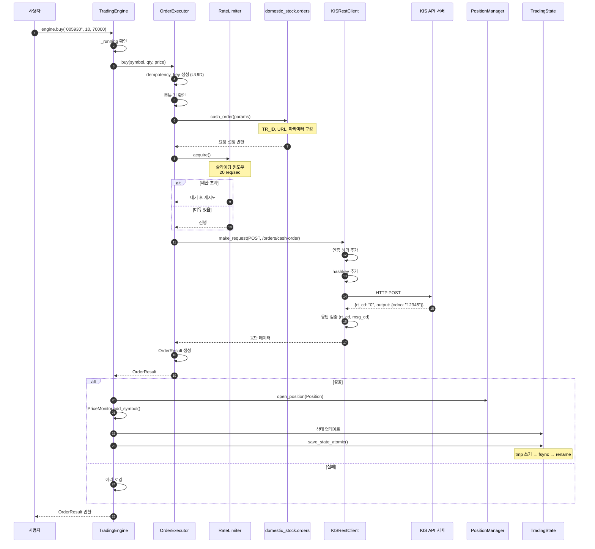

---

## 5. 가격 모니터링 흐름

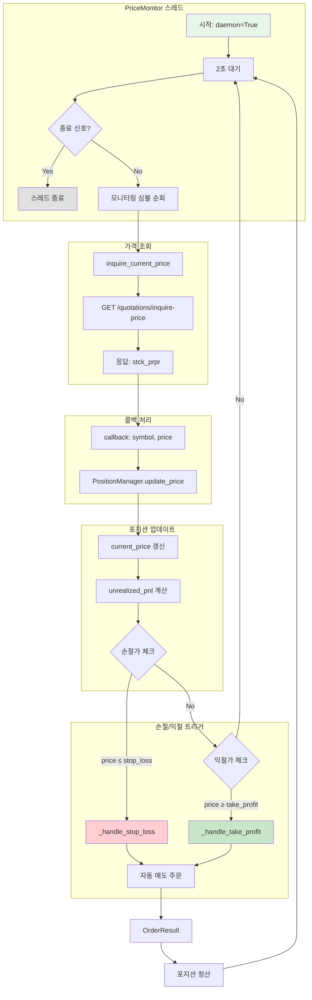

---

## 6. 포지션 조정 흐름

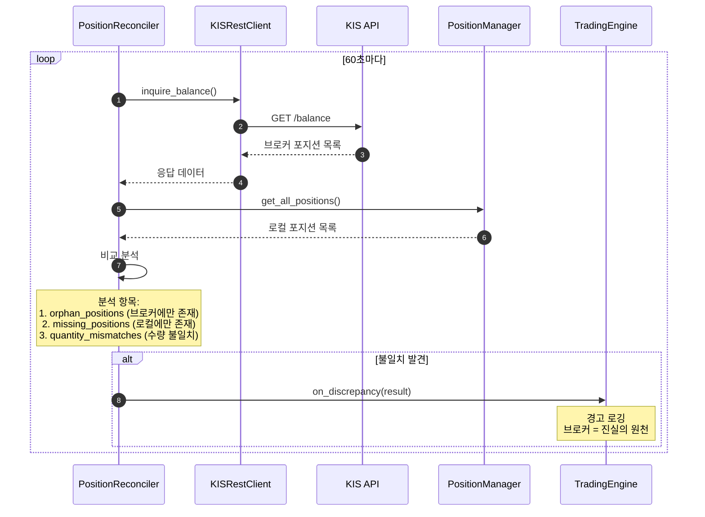

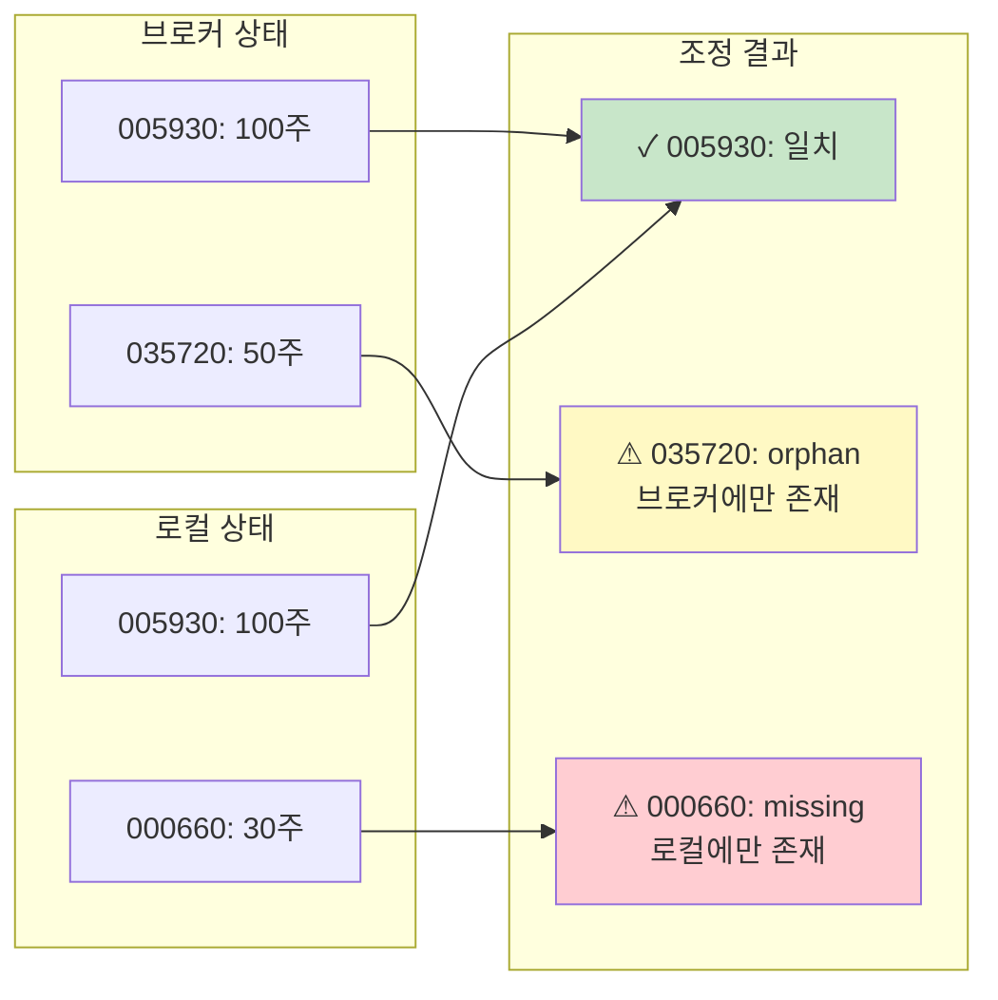

---

## 7. 상태 저장 및 복구 흐름

### 7.1 원자적 상태 저장

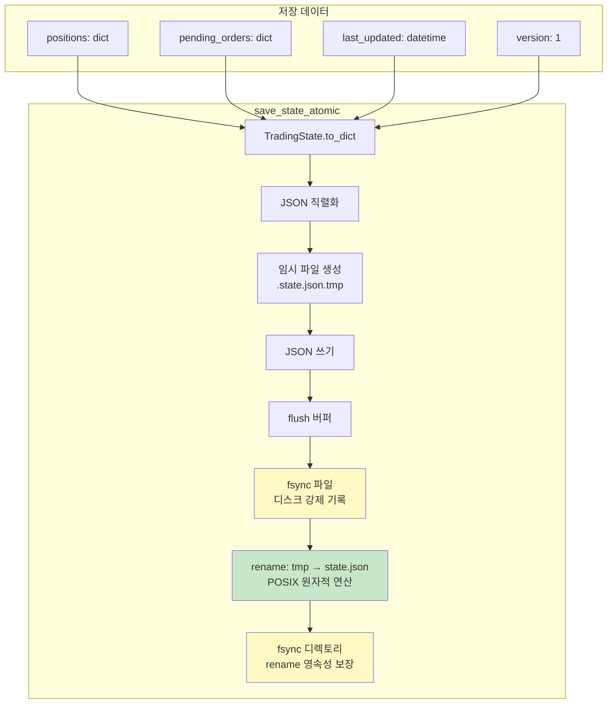

### 7.2 복구 흐름

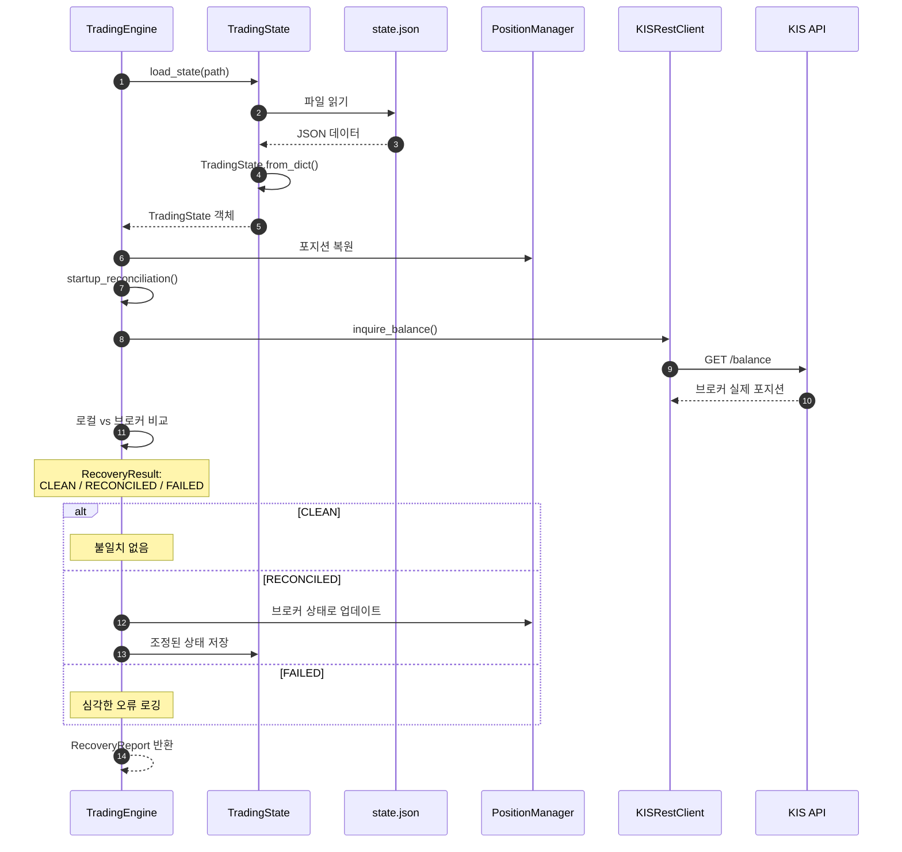

---

## 8. 컴포넌트 관계도

```mermaid
graph TB
    subgraph "stock_manager/"
        ENGINE[engine.py<br/>TradingEngine]
    end

    subgraph "adapters/broker/kis/"
        CLIENT[client.py<br/>KISRestClient]
        CONFIG[config.py<br/>KISConfig, KISConnectionState]
        EXCEPTIONS[exceptions.py<br/>KISException 계층]

        subgraph "apis/"
            OAUTH[oauth/oauth.py<br/>인증 함수]

            subgraph "domestic_stock/"
                BASIC[basic.py<br/>22 함수]
                ORDERS[orders.py<br/>25 함수]
                ANALYSIS[analysis.py<br/>30+ 함수]
                ELW[elw.py<br/>23 함수]
                INFO[info.py<br/>27 함수]
                RANKING[ranking.py<br/>23 함수]
                REALTIME[realtime.py<br/>30 함수]
                SECTOR[sector.py<br/>15 함수]
            end
        end
    end

    subgraph "trading/"
        MODELS[models.py<br/>Order, Position, Config]
        EXECUTOR[executor.py<br/>OrderExecutor]
        POSITIONS[positions.py<br/>PositionManager]
        RATE[rate_limiter.py<br/>RateLimiter]
        RISK[risk.py<br/>RiskManager]

        subgraph "strategies/"
            STRAT_BASE[base.py<br/>Strategy]
            GRAHAM[graham.py<br/>Graham전략]
        end

        subgraph "reflexivity/"
            CYCLE[cycle_detector.py]
            SIZING[sizing.py]
            THESIS[thesis.py]
        end
    end

    subgraph "monitoring/"
        PRICE_MON[price_monitor.py<br/>PriceMonitor]
        RECON[reconciler.py<br/>PositionReconciler]
    end

    subgraph "persistence/"
        STATE[state.py<br/>TradingState]
        RECOVERY[recovery.py<br/>복구 프로토콜]
    end

    ENGINE --> CLIENT
    ENGINE --> EXECUTOR
    ENGINE --> POSITIONS
    ENGINE --> RISK
    ENGINE --> PRICE_MON
    ENGINE --> RECON
    ENGINE --> STATE

    EXECUTOR --> ORDERS
    EXECUTOR --> RATE
    PRICE_MON --> BASIC
    RECON --> ORDERS

    CLIENT --> CONFIG
    CLIENT --> EXCEPTIONS
    CLIENT --> OAUTH

    STATE --> RECOVERY

    STRAT_BASE --> GRAHAM

    style ENGINE fill:#e1f5fe,stroke:#0288d1
    style CLIENT fill:#fff3e0,stroke:#ff9800
    style STATE fill:#fce4ec,stroke:#e91e63
```

---

## 9. 클래스 다이어그램

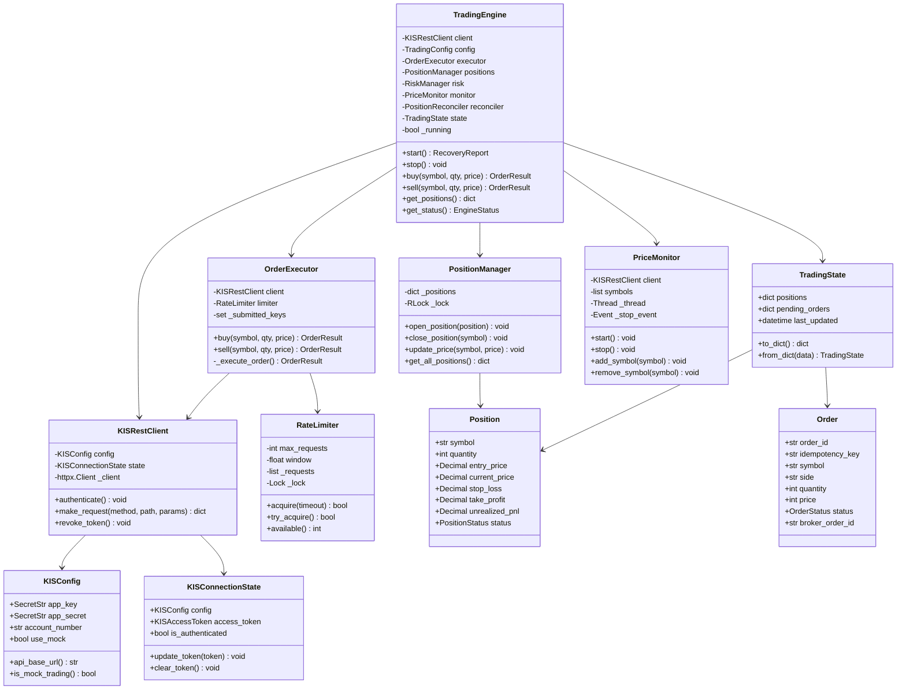

---

## 10. API 함수 호출 패턴

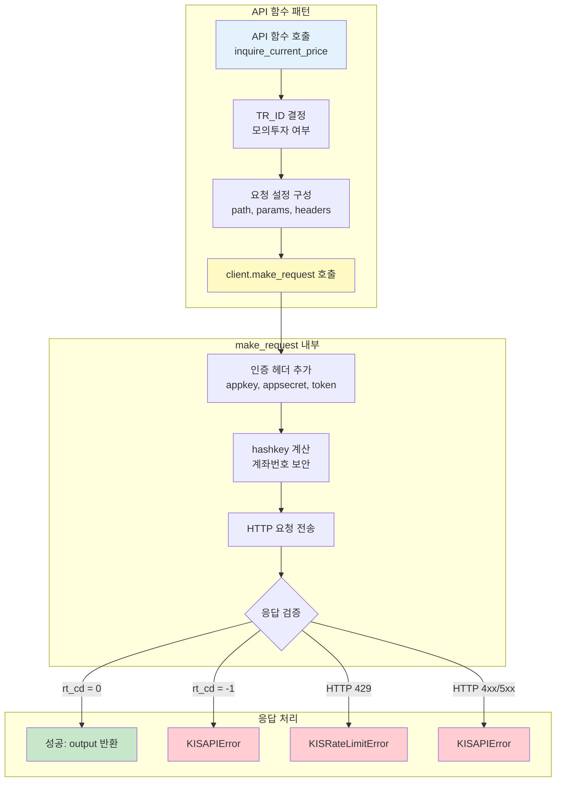

---

## 11. 에러 처리 계층

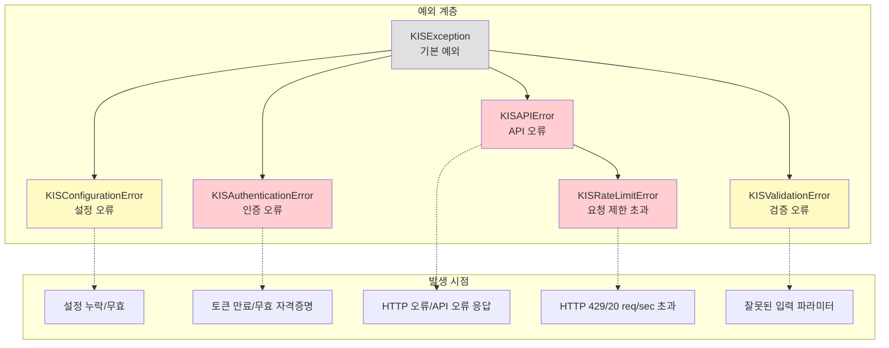

---

## 요약

| 구성요소 | 역할 | 스레드 안전 |
|---------|------|-----------|
| **TradingEngine** | 메인 오케스트레이터 | Context Manager |
| **KISRestClient** | HTTP 통신 | httpx.Client |
| **OrderExecutor** | 주문 실행, 멱등성 | UUID 키 |
| **PositionManager** | 포지션 관리 | RLock |
| **RateLimiter** | 20 req/sec 제한 | Lock |
| **PriceMonitor** | 2초 가격 폴링 | daemon 스레드 |
| **PositionReconciler** | 60초 조정 | daemon 스레드 |
| **TradingState** | 원자적 저장 | fsync + rename |

**핵심 원칙**: 브로커가 진실의 원천 (Broker is Source of Truth)
